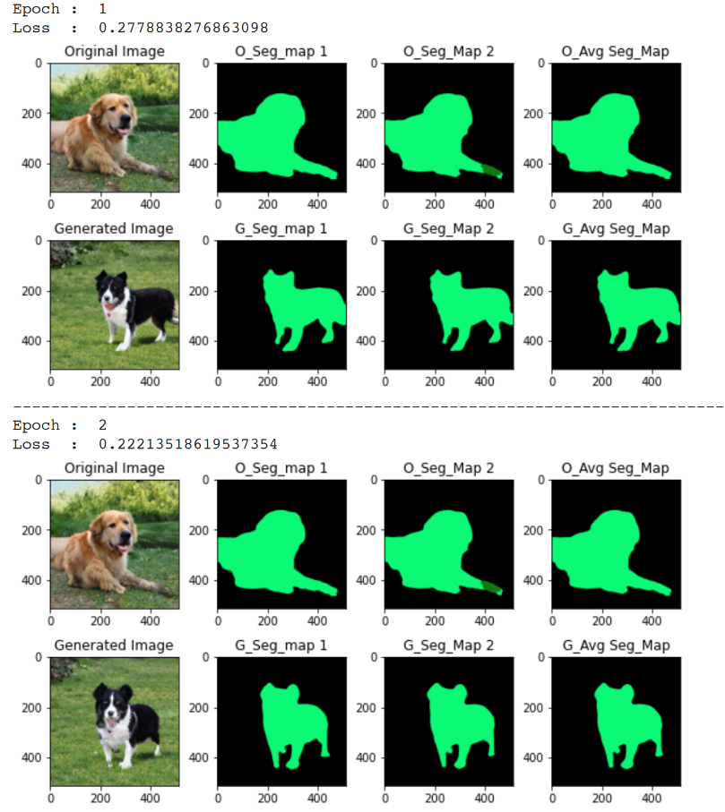
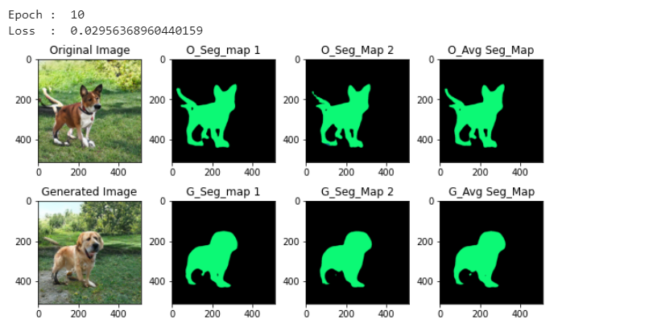

# BigGAN Generators combined with Image Segmentation Model in Pytorch 
A Pytorch implementation for replacing a dog/cat image with a GAN(Generative adversarial networks) generated image. The outline(segment mask) of the dog/cat is created using an Image segmentation model.

# Results 
||
|:--:|
|*1st epoch*|
||
|*10th epoch*|

# Pretrained Weights 
The pretrained weights are converted from the tensorflow hub modules: 
- https://tfhub.dev/deepmind/biggan-128/2  
- https://tfhub.dev/deepmind/biggan-256/2 
- https://tfhub.dev/deepmind/biggan-512/2  

# References 
paper: https://arxiv.org/abs/1809.11096

https://github.com/ajbrock/BigGAN-PyTorch
